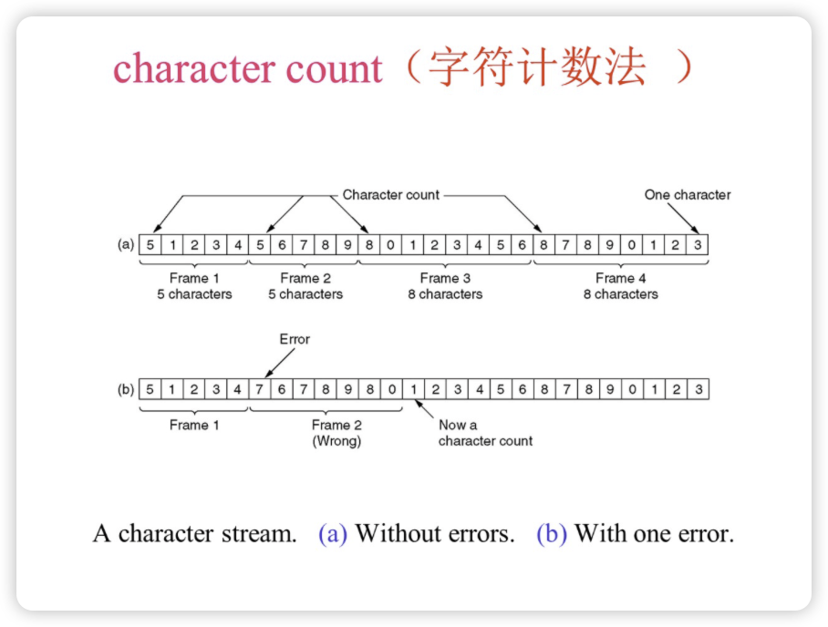
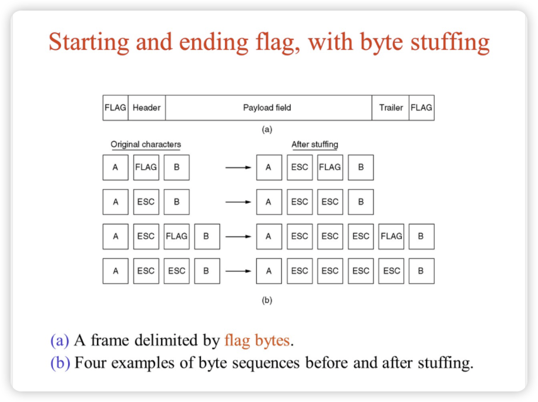
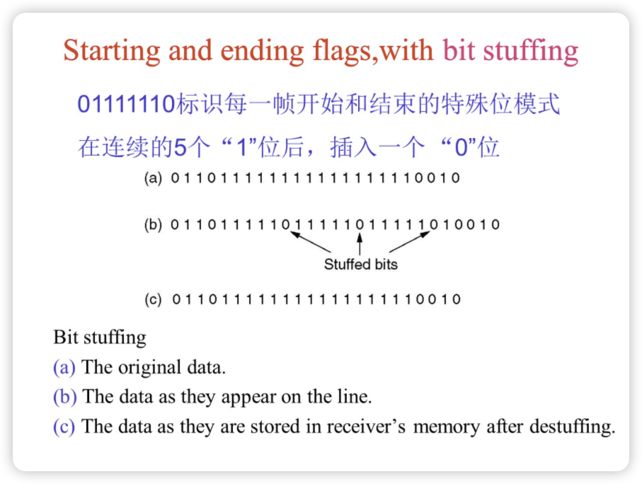
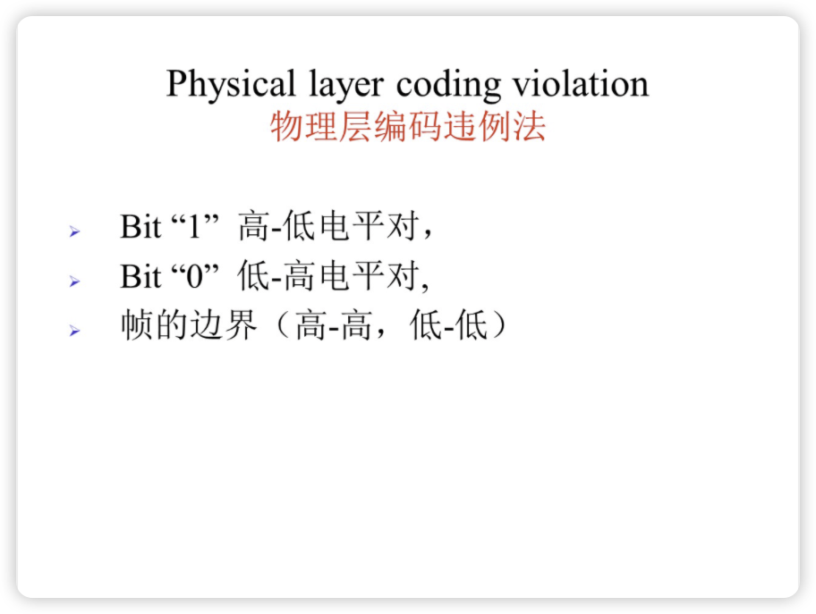

# 链路层

链路层传输的数据结构为帧（frame），网络层阐述的数据结构为分组（packet）。

| 层次       | 数据结构                                   | 说明                                          |
| ---------- | ------------------------------------------ | --------------------------------------------- |
| 应用层     | 数据（Data）                               | 应用程序生成的数据                            |
| 传输层     | TCP报文段（Segment）/UDP数据报（Datagram） | 封装端口信息，保证可靠或无连接的数据传输      |
| 网络层     | 分组（Packet）                             | 包含IP地址等路由信息，负责数据包的转发        |
| 数据链路层 | 帧（Frame）                                | 包含MAC地址等链路信息，确保数据在局域网内传输 |
| 物理层     | 比特（Bits）                               | 比特流形式的电信号或光信号，用于物理介质传输  |

## Framing

### 字符计数法

一个帧中的第一个字符表示该帧有多少字符（包括自身，所以至少有一个）

### 字节填充分界符法

使用FLAG标志着一个帧的开始和结束，但数据字段中也有可能出现FLAG，所以需要一个ESC转义，经过转义的FLAG就是正常的数据而不再标记着帧的开始和结束。

但是ESC转义字符也有可能在数据字段中出现，所以需要对ESC转义字符进行转义，表示这是一个数据而不是转义字符。

这会增加传输的开销，最大为100%（增添的字节数/原本的字节数），当数据段全为我们设置的FLAG或ESC时，全部需要转义。

### 位填充分界符法

位填充相对于字节填充视角更细致，所以开销也更小。总的来说就是每遇到连续的5个1，不管第6个是什么都要在5个1之后添加0，从而防止连续的6个1的出现。

我们用连续的01111110作为标识，因为传输的数据中这种情况很少，而且可以通过上述办法进行避免数据和标识的重叠。再进行解码时，遇到5个1之后有0的情况去掉这个0，就可以得到原始数据。

### 物理层编码违例法

将电平的高-高和低-低作为帧的边界，而1转化为高-低电平对，0转化为低-高电平对，相对于直接将0转化为低电平，1转化为高电平的好处是：如果有连续的低电平或者高电平，我们根据电平将很难区分有多少个0或者1，而电平对的形式就很好的引入了“节拍”，很容易计数，且能够用来区分帧的边界。

## 海明码

[【官方双语】汉明码Pa■t1，如何克服噪■](https://www.bilibili.com/video/BV1WK411N7kz/?spm_id_from=333.337.search-card.all.click&vd_source=519c4464a364b8611b8a226be3cda0f6)

[【官方双语】汉明码part2，优雅的全貌](https://www.bilibili.com/video/BV1pV411y7E8/?spm_id_from=333.788.recommend_more_video.-1&vd_source=519c4464a364b8611b8a226be3cda0f6)

